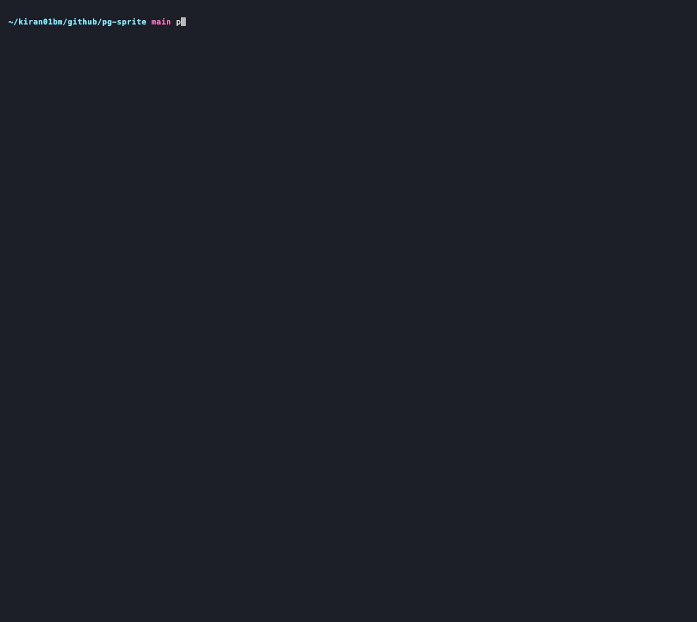

# pg-sprite

> [!WARNING]
> **Early release — not production-ready.** This project is under active
> development. Tagged releases exist, but pre-1.0 there are no stability
> guarantees and no support. Interfaces, behavior, on-disk/database artifacts,
> and the CLI surface may all change between releases. Do **not** run this
> against any database you care about.

> Working name — see the naming task in the research build tracker.

An online schema-change engine for **PostgreSQL** (community, RDS, and
Aurora; 14+): a decoupled **planner → router → executor** design where the
planner classifies each change, the router picks a strategy, and
interchangeable executors carry it out — the cheap native PostgreSQL idiom
when one exists (`CONCURRENTLY`, `NOT VALID` + `VALIDATE`, fast default,
`USING INDEX`), while a log-based, checksum-gated, resumable copy-and-swap for
genuine table rewrites lands in a later phase.

The planner is PostgreSQL's missing `ALGORITHM=` / `LOCK=` declaration: MySQL
lets authors assert a cost bracket and a concurrency impact and fails closed
when either can't be honored — PostgreSQL silently runs whichever cost
applies. pg-sprite proves both dimensions before execution, routes each
change to the safest sequence that exists, and refuses with a structured
verdict when it can't prove one (see
[docs/postgres-online-ddl-reference.md](docs/postgres-online-ddl-reference.md)).

**Status: Phases 1 and 2.1–2.5.** The parse boundary, declarative diff,
classifier, router seam, versioned dry-run plan report, offline linter, and
advisory `suggest` command are implemented. `pg-sprite migrate --alter '…'` classifies and
routes the statement, then executes the routed SQL — the planner's safer native sequence by
default when the submitted form blocks (reported in the verdict's `executed_sql`), a bounded
optimistic native attempt otherwise. A gated `--force` runs the submitted form as-is under the
same budgets. Changes without an available backend get a structured refusal (exit code 2).
The design docs and the phased
build plan live in [docs/](docs/) — start with
[docs/README.md](docs/README.md); the vision — what pg-sprite is and is not —
is [docs/vision.md](docs/vision.md).

The codebase is partitioned into a small safety-critical core and a
periphery — **[SAFETY.md](SAFETY.md)** says which packages are which and the
rules that apply inside the core. Read it before changing anything under
`pkg/`.

## What it looks like

Everything below is captured from a real session against the compose
database (`make db-up`, PostgreSQL 16). The reports color their labels the
way compilers do when stdout is a terminal; `--color=never` or a non-empty
`NO_COLOR` forces plain text, and the `--json` / `--sql` machine outputs
are never colored.



Animated demos for the other routes — declarative diff, refusal with typed
help, offline lint — live in [docs/demos/](docs/demos/), rendered from committed
[VHS](https://github.com/charmbracelet/vhs) tapes (`make demos` re-renders
them).

**Diff: declarative desired state in, classified plan out.** Point at a
reviewed `CREATE TABLE` file and get the statements that converge the live
table onto it, reported in the same diagnostic grammar as the dry run.
`--sql` prints the plan as an executable SQL script instead, and a plan
containing a statement execution would refuse exits 2 — the same CI gate
as the dry run. Watch it in
[docs/demos/diff-greenfield.gif](docs/demos/diff-greenfield.gif); the
machine-readable shape is in
[docs/cli-output-examples.md](docs/cli-output-examples.md).

**Improve: a blocking form is replaced with the safer online sequence.**
`migrate --dry-run` shows exactly what would run, as compiler-style
diagnostics with a doc anchor per finding (exit 0 — the plan is executable).
The demo above records the whole flow — dry run, real run, catalog proof;
why the substituted sequence is safer — same end state, different locking
— is worked through in [docs/safer-sequences.md](docs/safer-sequences.md);
the machine-readable shape is in
[docs/cli-output-examples.md](docs/cli-output-examples.md).

**Refuse: no safe path exists, so nothing runs.** A genuine table rewrite
needs the copy-and-swap backend (a later phase); the dry run exits 2 so CI
can gate on it without parsing JSON. The exit-code gate stops refusals only —
a destructive-but-executable change (`DROP COLUMN`) warns and exits 0, so a
gate that must stop drops checks `.statements[].destructive` in the
`--json` report. Watch it in
[docs/demos/refuse.gif](docs/demos/refuse.gif); the machine-readable shape
is in [docs/cli-output-examples.md](docs/cli-output-examples.md).

**Lint: offline, no database needed.** Flag blocking idioms in a DDL file
and suggest the safer form — no connection, no Docker; error-severity
findings exit non-zero, warnings alone pass. Watch it in
[docs/demos/lint.gif](docs/demos/lint.gif); the machine-readable shape is
in [docs/cli-output-examples.md](docs/cli-output-examples.md).

More shapes — every disposition as JSON, destructive warnings, and exit
codes — are in [docs/cli-output-examples.md](docs/cli-output-examples.md).

## Install

Release archives for linux/darwin on amd64/arm64, with `checksums.txt`, are
published on the [releases page](https://github.com/block/pg-sprite/releases)
once tags exist. The binary is pure Go (the SQL parser is Wasm), so on any
other platform — or without waiting for a release — `go install` works with
no C toolchain:

```sh
go install github.com/block/pg-sprite/cmd/pg-sprite@latest
```

## Commands

Half the CLI works offline on DDL text alone; the other half connects to a
live database (`--url` / `PGSPRITE_URL`, always under bounded `lock_timeout`
and `statement_timeout`). Only `migrate` without `--dry-run` ever commits a
change — every other command is read-only or fully offline.

| Command | Live database | What the connection is used for |
|---|---|---|
| `migrate` | required | Resolve the target table, preflight it (privileges, partitioning, size and catalog facts), classify and route the change, then **execute** the routed SQL under bounded budgets |
| `migrate --dry-run` | required | The same introspection as a real run — server version, target resolution, table facts — so the printed plan reflects the actual target; executes nothing |
| `diff` | required | Introspect the live table (read-only) and materialize the desired-state file on a scratch schema inside a transaction that is always rolled back; prints the plan, changes nothing |
| `status` | required | Read-only view over `pg_stat_activity` for live pg-sprite sessions on the connected database |
| `fmt` | none | Canonicalize a schema file — parser only |
| `lint` | none | Flag patterns the engine would refuse, rewrite, or gate, from the DDL text alone |
| `suggest` | none | Map risky DDL to the safer native form the engine would run, with typed caveats; advisory, always exits 0 |

The offline commands have no connection flags at all, so they cannot be
pointed at a database by accident.

**If a multi-step change fails halfway, what state is my table in?** Every
step before the failure has committed and is harmless to live traffic; the
failing step rolled back; nothing after it ran — and the verdict names the
exact boundary. Why safer sequences run without a wrapping transaction
(PostgreSQL forbids it for the online forms) and what each documented
partial state means is [docs/execution-model.md](docs/execution-model.md).

## Demo

A runnable tour of the CLI against a local PostgreSQL (Docker required):

```sh
make demo
```

It builds the binary, starts the compose database, seeds demo tables, and
walks every planner route (dry-run), the declarative diff, the offline
commands, and real executions — including the safer-sequence substitutions
and a structured refusal. Rerunnable; see [demo/README.md](demo/README.md).

## Development

```sh
make setup       # one-time: configure git hooks (.githooks)
make build       # build ./... and the bin/pg-sprite binary
make test        # full suite; integration tests need Docker
make test-unit   # unit tests only (SKIP_INTEGRATION=1)
make lint        # golangci-lint
```

Integration tests run against a real PostgreSQL via testcontainers. `PG_VERSION`
selects the major (default 16); CI runs the matrix 14 → 18. To iterate against a
long-lived local database instead of per-test containers:

```sh
make db-up PG_VERSION=14   # start PostgreSQL 14 on localhost via compose
make test-db               # run the suite against it (PG_DSN)
make db-down               # stop and discard it
```

`make test-supported-postgres` runs the full suite against every supported
major (14 → 18) — the local mirror of the CI matrix. See
[docs/testing.md](docs/testing.md) for the test-suite layout, what each build
phase owes, and the vanilla-PostgreSQL-vs-real-Aurora validation boundary.

## Contributing

Not yet — see [CONTRIBUTING](CONTRIBUTING.md). Safety-relevant issue
reports are welcome even at this stage.

## License

[Apache 2.0](LICENSE)
