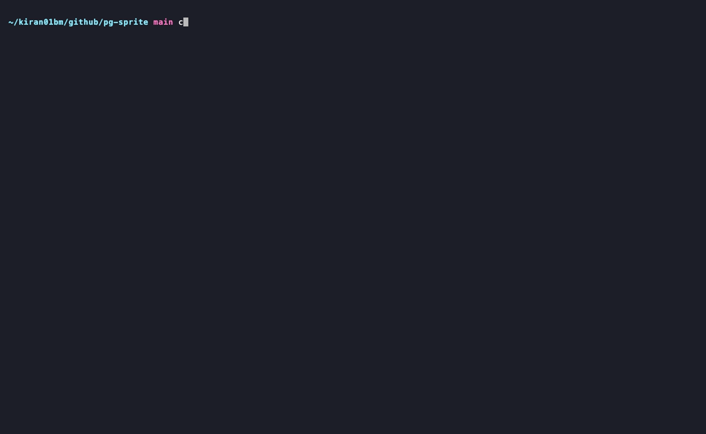
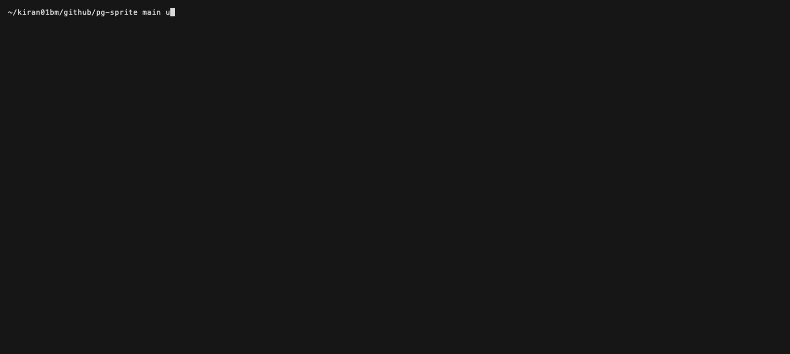

# Terminal demos

VHS tapes for the README/docs demo GIFs. Each tape is deterministic and
rerunnable: hidden setup reseeds the database state it needs, so a re-render
after a CLI output change is just `make demos` (or `vhs <tape>` from this
directory).

## Prerequisites

- [VHS](https://github.com/charmbracelet/vhs) (`brew install vhs`)
- A built binary: `make build`
- The compose database for the database-backed tapes: `make db-up`
  (`lint.tape` is fully offline)

## Tapes

### `diff-greenfield.tape` — declarative diff, greenfield (needs database)

Declarative diff for a table absent from the live database: the full
desired schema planned as a diagnostic report with the greenfield note.



### `improve.tape` — the safer online sequence, then the declarative loop (needs database)

Dry-run of a blocking `ADD CONSTRAINT … UNIQUE`, the real run executing
the safer online sequence, `\d users` catalog proof — then the declarative
loop: `diff --desired` plans the remaining change, `migrate` executes it,
`diff` confirms convergence.


### `refuse.tape` — refusal and the exit-code contract (needs database)

`error[rewrite-required]` refusal with typed `note`/`help` diagnostics and
doc anchors, then `echo $?` showing the exit-code contract (2).


### `lint.tape` — offline lint (no database)

Offline lint of a two-statement change file — `unset PGSPRITE_URL` on
camera to show no database is needed.



## Re-rendering

```sh
make build db-up
make demos
```

The GIFs are committed next to the tapes so the README renders without any
build step. Nothing pins them: renderer tests pin
`docs/cli-output-examples.md` and the contract docs, and CI's demo smoke
test asserts on `demo/tour.sh` output, but the README samples and these
GIFs drift silently when CLI output changes — re-rendering is a manual
duty, done in the same change that alters the output. Each re-render
commits whole new binary blobs (no deltas), so re-render only the tapes
whose recorded output actually changed; if the accumulated weight starts
to bite, the GIFs move to release assets.

## Tape-writing notes

- The tape parser has no escapes inside `"..."` — use backtick strings for
  commands containing double quotes; `\n` types literally (use one `echo` per
  line instead of `printf '\n'`; a single `\d` is fine for psql).
- Keep a `Sleep` between the hidden `clear` and `Show`, or capture resumes
  before the screen clears and setup commands leak into the first frames.
- The prompt is set in hidden setup so recorded frames show only the command
  and its output.
